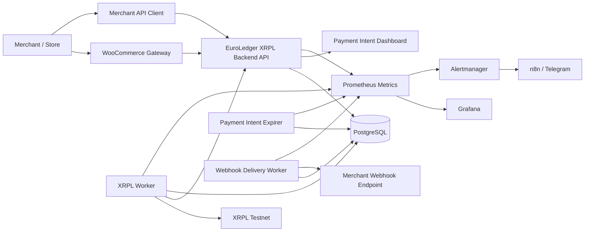
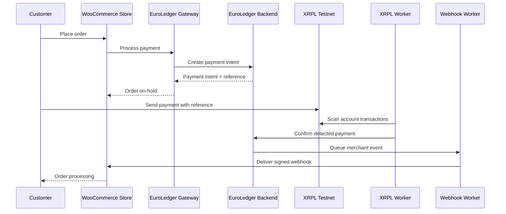

# EuroLedger XRPL

EuroLedger XRPL is an open, testnet-first proof of concept for euro-denominated payment intents, XRPL payment detection, merchant webhooks and WooCommerce checkout integration.

The project explores how the XRP Ledger can be used as an open technical settlement layer while keeping the merchant and customer experience centered around euro-denominated payments and reconciliation.

> Status: proof of concept, local development and XRPL testnet validation. Not production financial infrastructure.

## What it does today

EuroLedger XRPL currently provides:

- a FastAPI backend for merchant-scoped payment intents;
- idempotent payment intent creation and lifecycle management;
- XRPL testnet payment detection using references and memos;
- payment intent expiration and cancellation flows;
- merchant API key authentication;
- merchant webhook endpoint management;
- signed webhook delivery with retry and delivery tracking;
- worker health and Prometheus metrics;
- Grafana, Prometheus and Alertmanager observability examples;
- n8n alerting workflows for Telegram notifications;
- a WooCommerce payment gateway supporting classic checkout and Checkout Blocks;
- merchant-facing WooCommerce installation documentation;
- release packaging workflow for the WooCommerce plugin.

## What this project is not

EuroLedger XRPL is not:

- a cryptocurrency investment product;
- a stablecoin issuer;
- a custody service;
- a regulated financial service;
- a replacement for the euro or a digital euro;
- a recommendation to buy, sell or hold XRP.

See [Legal disclaimer](docs/legal-disclaimer.md) and [Scope](docs/scope.md).

## High-level architecture



## Payment flow



## Repository layout

```text
automation/n8n/          n8n workflow exports for alert routing
backend/                 FastAPI application, models, migrations, workers and tests
docs/                    Project, operations, webhook, WooCommerce and release docs
examples/                Standalone webhook receiver examples
observability/           Prometheus, Grafana and Alertmanager configuration
plugin-woocommerce/      WooCommerce gateway plugin and local dev environment
scripts/dev/             Development and packaging helper scripts
sdk/                     Reserved for future SDKs
tests/                   Reserved for future top-level tests
worker/                  Reserved for future worker split-out
```

## Quick start

From the repository root:

```bash
docker compose up --build -d
```

Check the backend:

```bash
curl http://localhost:8000/health
```

Run backend quality checks:

```bash
docker compose exec backend ruff check app tests
docker compose exec backend ruff format --check app tests
docker compose exec backend pytest
```

For backend-specific commands, see [Backend README](backend/README.md).

## WooCommerce gateway

The WooCommerce gateway lives in:

```text
plugin-woocommerce/euroledger-xrpl-gateway/
```

Current documented plugin release: `0.1.3`.

It supports:

- classic WooCommerce checkout;
- WooCommerce Checkout Blocks;
- EuroLedger payment intent creation;
- signed webhook updates from EuroLedger;
- order metadata and admin visibility;
- local smoke and end-to-end validation scripts;
- distributable ZIP packaging.

Start with:

- [WooCommerce integration README](plugin-woocommerce/README.md)
- [Gateway plugin README](plugin-woocommerce/euroledger-xrpl-gateway/README.md)
- [Merchant installation guide](docs/woocommerce-merchant-installation-guide.md)
- [Checkout Blocks documentation](docs/woocommerce-checkout-blocks.md)
- [WooCommerce gateway 0.1.3 release notes](docs/woocommerce-gateway-0.1.3.md)

## Documentation

The documentation entry point is:

- [Documentation index](docs/index.md)

Key documents:

- [Vision](docs/vision.md)
- [Scope](docs/scope.md)
- [Architecture](docs/architecture.md)
- [Merchant webhooks](docs/merchant-webhooks.md)
- [Merchant webhook operations](docs/merchant-webhook-operations.md)
- [Observability](docs/observability.md)
- [CI](docs/ci.md)

## Observability and alerting

The repository includes local examples for:

- Prometheus metrics scraping;
- Grafana dashboards;
- Alertmanager routing;
- n8n workflows for Telegram alert delivery.

Start with:

- [Observability](docs/observability.md)
- [Alerting](docs/alerting.md)
- [Alertmanager routing](docs/alertmanager-routing.md)
- [n8n Alertmanager workflow](docs/n8n-alertmanager-workflow.md)
- [n8n Telegram notifications](docs/n8n-telegram-notifications.md)

## Releases

Release documentation currently focuses on the WooCommerce gateway:

- [WooCommerce gateway 0.1.1](docs/releases/woocommerce-gateway-0.1.1.md)
- [WooCommerce gateway 0.1.2](docs/releases/woocommerce-gateway-0.1.2.md)
- [WooCommerce gateway 0.1.3 public release notes](docs/releases/woocommerce-gateway-0.1.3-public.md)

Generated release ZIPs belong in `dist/`, which is intentionally ignored by Git.

## License

This project is licensed under the terms included in [LICENSE](LICENSE).
