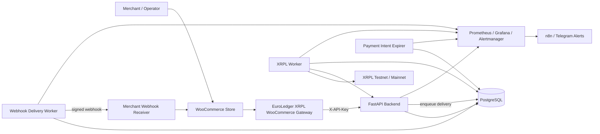
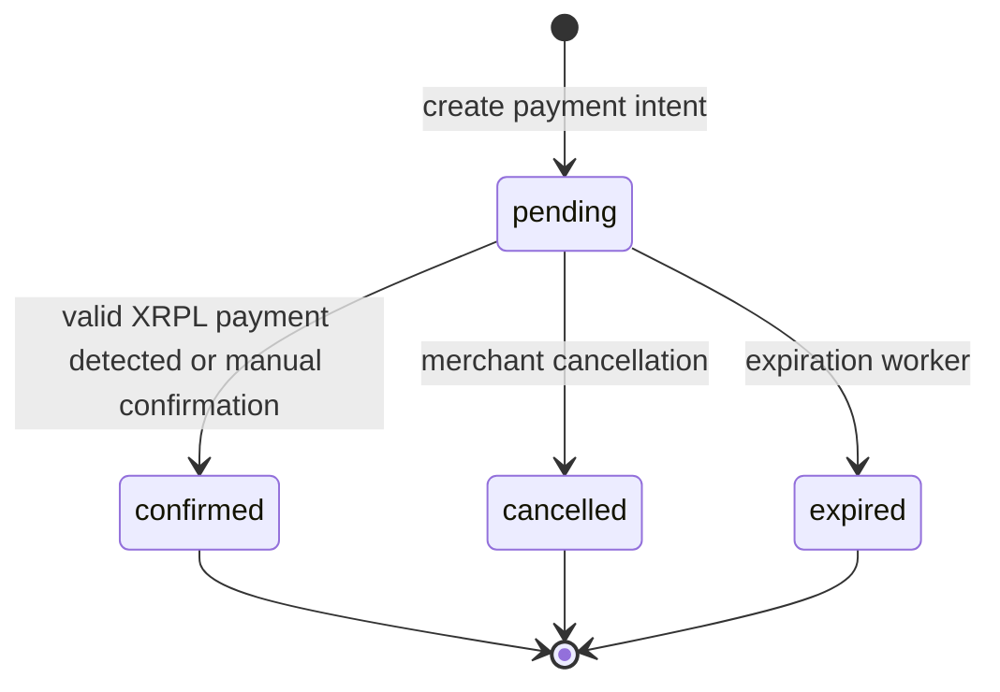
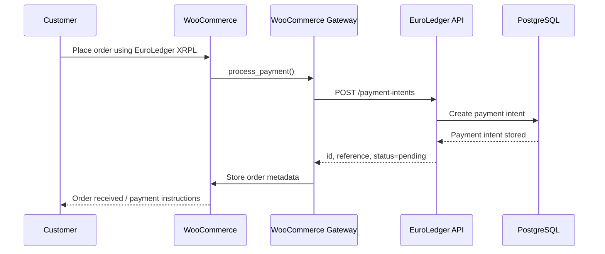
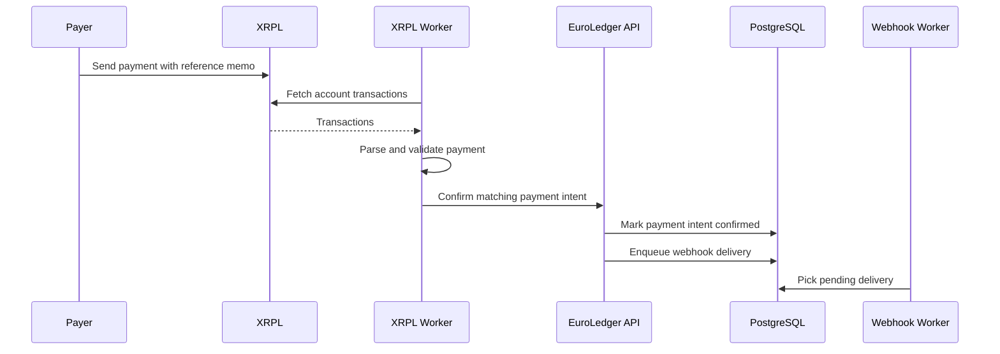
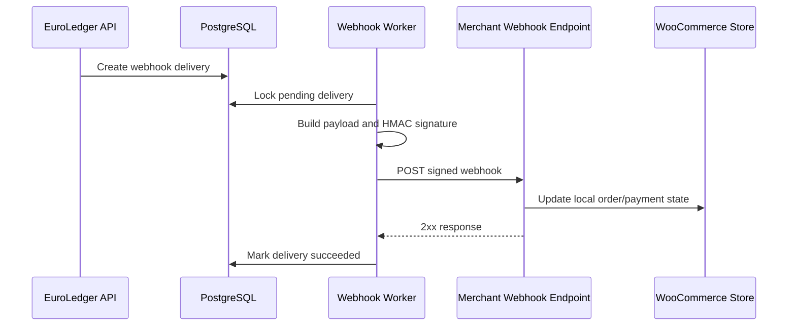
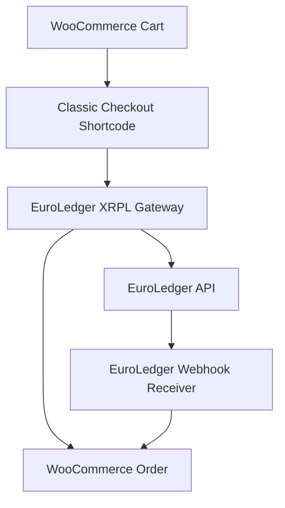
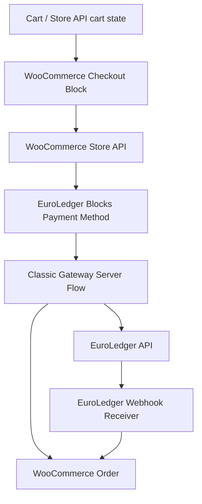
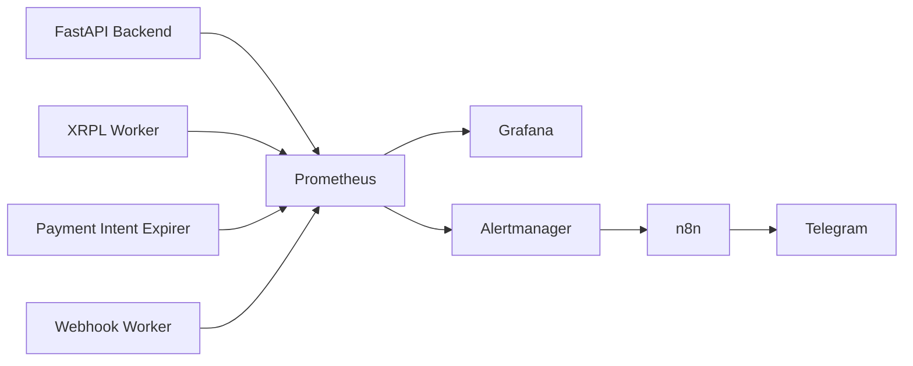

# EuroLedger XRPL Architecture

This document describes the current EuroLedger XRPL architecture, the main runtime components, and the payment flows that connect the backend, XRPL workers, merchant webhooks, observability, and the WooCommerce gateway.

## Current scope

EuroLedger XRPL is a merchant payment infrastructure prototype for XRP Ledger based payments.

The current repository includes:

- A FastAPI backend.
- PostgreSQL persistence with Alembic migrations.
- Merchant API key authentication.
- Payment intent lifecycle management.
- XRPL payment scanning and validation workers.
- Payment intent expiration worker.
- Merchant webhook endpoints and delivery worker.
- Prometheus metrics and health/status endpoints.
- Grafana, Prometheus, Alertmanager and n8n alerting workflows.
- A WooCommerce payment gateway with classic checkout and Checkout Blocks support.

## High-level architecture

## Runtime components

### FastAPI backend

The backend is the central API and domain service.

Responsibilities:

- Create payment intents.
- Generate unique payment references.
- Enforce merchant API key authentication.
- Enforce merchant isolation.
- Handle idempotency keys.
- Confirm, cancel and expire payment intents.
- Expose payment intent listing and CSV export.
- Expose dashboard views.
- Manage merchant webhook endpoints.
- Enqueue webhook deliveries.
- Expose health and metrics endpoints.

### PostgreSQL

PostgreSQL stores the system state.

Main data areas:

- Merchants.
- Merchant API keys.
- Payment intents.
- Worker state and worker health.
- Payment intent expirer state.
- Merchant webhook endpoints.
- Merchant webhook deliveries.
- Webhook delivery worker state.

Schema changes are managed with Alembic.

### XRPL worker

The XRPL worker scans XRPL transactions and validates detected payments.

Responsibilities:

- Fetch account transactions.
- Parse XRPL payment transactions.
- Extract references from memos.
- Validate destination, amount, currency and reference.
- Match XRPL payments with pending payment intents.
- Confirm payment intents when a valid payment is detected.
- Record worker health and metrics.

### Payment intent expirer

The expirer transitions stale pending payment intents to an expired state.

Responsibilities:

- Find pending payment intents past their expiration time.
- Mark them as expired.
- Store worker state.
- Expose expiration metrics through the backend metrics endpoint.

### Webhook delivery worker

The webhook worker delivers merchant webhook events asynchronously.

Responsibilities:

- Pick pending webhook deliveries.
- Sign webhook payloads.
- Send HTTP webhook requests to merchant endpoints.
- Record delivery attempts, failures and successes.
- Retry failed deliveries according to the configured retry policy.
- Expose delivery state and metrics.

### WooCommerce gateway

The WooCommerce gateway allows stores to accept EuroLedger XRPL payments.

Responsibilities:

- Create payment intents from WooCommerce orders.
- Store EuroLedger metadata on WooCommerce orders.
- Display payment metadata in the WooCommerce admin.
- Receive signed EuroLedger webhooks.
- Update WooCommerce orders after payment confirmation.
- Support classic checkout.
- Support WooCommerce Checkout Blocks through Store API payment method registration.

### Observability stack

The observability stack provides operational visibility.

Components:

- Prometheus for metrics scraping.
- Grafana for dashboards.
- Alertmanager for alert routing.
- n8n workflows for alert processing and Telegram notifications.

## Payment intent lifecycle

## Payment creation flow

## XRPL confirmation flow

## Merchant webhook delivery flow

## WooCommerce checkout flows

### Classic checkout

### Checkout Blocks

The Blocks integration registers `euroledger_xrpl` as a Store API compatible payment method and reuses the existing server-side gateway processing flow.

## Observability and alerting flow

## Security boundaries

### Merchant API authentication

Merchant-facing API calls use API key authentication.

The backend must ensure:

- API keys are hashed or stored safely.
- Payment intents are scoped to their owning merchant.
- Merchants cannot access another merchant's payment intents, webhook endpoints or deliveries.
- Idempotency keys are interpreted within the merchant scope.

### Webhook signing

Merchant webhooks are signed before delivery.

Receivers must verify:

- Signature header.
- Webhook secret.
- Payload integrity.
- Event type.
- Payment intent identity and reference.

### WooCommerce plugin secrets

The WooCommerce plugin stores merchant configuration values in WordPress options.

Required sensitive values:

- Merchant API key.
- Webhook secret.

These values should not be committed, exported in public logs, or included in screenshots.

## Operational notes

Before public deployment, operators should review:

- Environment variable examples.
- Secret handling.
- Public HTTPS exposure for webhook receivers.
- Alertmanager webhook secret files.
- Grafana dashboards.
- Prometheus scrape targets.
- Worker health thresholds.
- Backup and migration process for PostgreSQL.

## Documentation links

Related documentation:

- [Documentation index](index.md)
- [Backend README](../backend/README.md)
- [Merchant webhooks](merchant-webhooks.md)
- [Merchant webhook operations](merchant-webhook-operations.md)
- [Webhook notifications](webhook-notifications.md)
- [Observability](observability.md)
- [Alerting](alerting.md)
- [CI](ci.md)
- [WooCommerce Checkout Blocks](woocommerce-checkout-blocks.md)
- [WooCommerce merchant installation guide](woocommerce-merchant-installation-guide.md)
- [Publication readiness plan](publication-readiness-plan.md)
