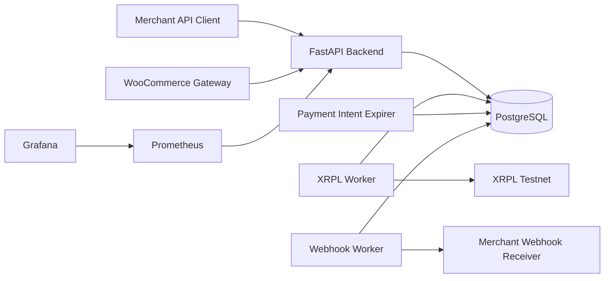
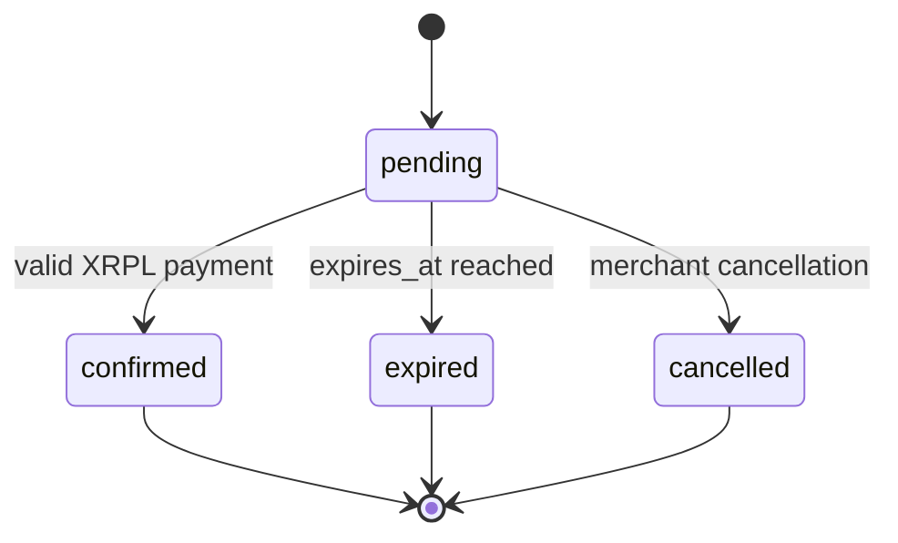
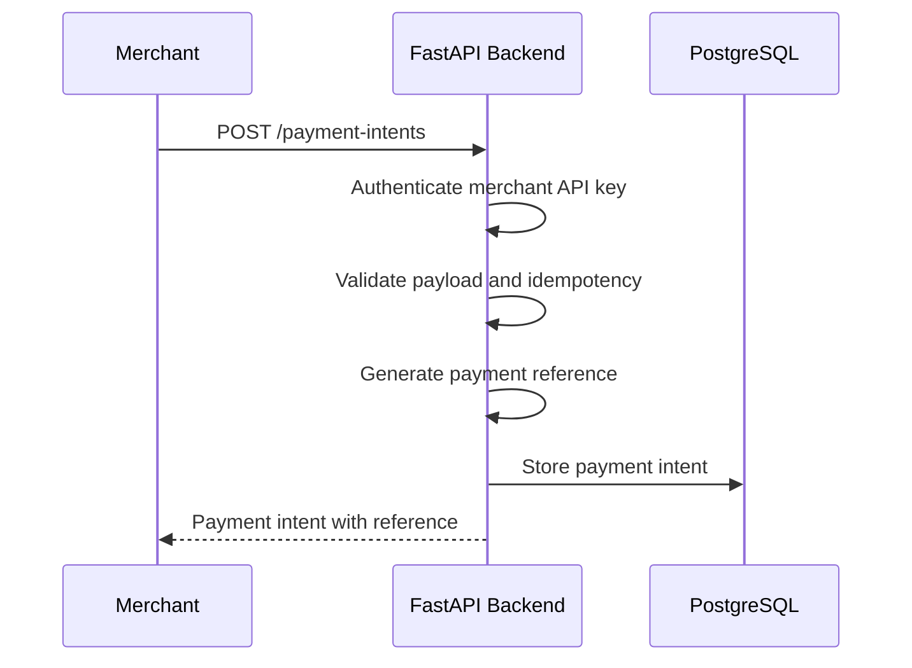
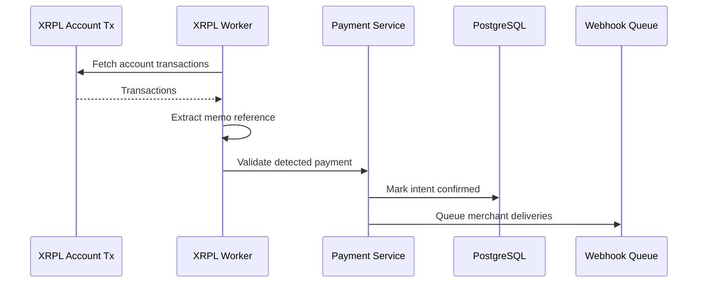

# Backend API and Operations

This document is the main backend documentation map for EuroLedger XRPL.

It explains how the FastAPI backend, PostgreSQL database, background workers, merchant webhooks, dashboard, metrics, and CI documentation fit together.

## Audience

Use this document if you are:

- developing the backend;
- operating the local stack;
- integrating directly with the merchant API;
- debugging payment intent lifecycle issues;
- validating worker, webhook, or observability behavior.

For the high-level system view, start with [Architecture](architecture.md).

## Backend responsibilities

The backend owns:

```text
merchant authentication
payment intent lifecycle
payment reference generation
XRPL payment validation
merchant webhook configuration
webhook delivery queueing and retries
worker state persistence
metrics and operational health
```

The WooCommerce plugin is an integration client. The backend remains the system of record for payment intents.

## Runtime services



## API groups

### Authentication

```text
GET /auth/me
```

Use this endpoint to validate an API key and inspect the authenticated merchant.

### Payment intents

Payment intent endpoints are merchant-scoped.

```text
POST /payment-intents
GET /payment-intents
GET /payment-intents/export.csv
GET /payment-intents/by-reference/{reference}
GET /payment-intents/{payment_intent_id}
POST /payment-intents/{payment_intent_id}/confirm
POST /payment-intents/{payment_intent_id}/cancel
POST /payment-intents/detected-payments
```

Key behaviors:

- `POST /payment-intents` accepts `Idempotency-Key`.
- Listing supports status, reference, date range, cursor, and limit filters.
- CSV export is available for reconciliation.
- Confirmation can be triggered by validated XRPL detection or by explicit API confirmation.
- Cancellation and expiration are terminal transitions.

### Webhook endpoints

```text
POST /webhook-endpoints
GET /webhook-endpoints
GET /webhook-endpoints/{endpoint_id}
PATCH /webhook-endpoints/{endpoint_id}
DELETE /webhook-endpoints/{endpoint_id}
POST /webhook-endpoints/{endpoint_id}/test
```

Webhook endpoints are scoped to the authenticated merchant.

Secrets are accepted on create/update but are not returned by the API.

### Webhook deliveries

```text
GET /webhook-deliveries
GET /webhook-deliveries/{delivery_id}
POST /webhook-deliveries/{delivery_id}/retry
```

Webhook deliveries are created when payment intents transition to terminal states.

Delivery states include:

```text
pending
delivered
failed
discarded
```

### Operations

```text
GET /health
GET /health/live
GET /health/ready
GET /worker-status
GET /metrics
GET /dashboard/payment-intents/{payment_intent_id}?token=...
```

The dashboard route is intended for development and operational inspection. It should not be exposed publicly without a stronger authentication layer.

## Payment intent lifecycle



### Creation



### Confirmation



## Workers

### XRPL worker

The XRPL worker synchronizes account transactions and confirms matching payment intents.

Primary docs:

- [Architecture](architecture.md)
- [Backend README](../backend/README.md)

Useful commands:

```bash
docker compose logs -f xrpl-worker
docker compose exec backend xrpl-worker --testnet --limit 20
```

### Payment intent expirer

The expirer marks stale pending intents as `expired`.

Primary doc:

- [Payment intent expiration](payment-intent-expiration.md)

Useful commands:

```bash
docker compose logs -f payment-intent-expirer
docker compose exec backend payment-intent-expirer --limit 100
```

### Webhook worker

The webhook worker delivers queued merchant webhook events.

Primary docs:

- [Merchant webhooks](merchant-webhooks.md)
- [Merchant webhook operations](merchant-webhook-operations.md)

Useful commands:

```bash
docker compose logs -f webhook-worker
docker compose exec backend webhook-worker --limit 100
```

## Merchant webhook documentation

Use these documents together:

- [Merchant webhooks](merchant-webhooks.md) — API, signatures, endpoint configuration, delivery flow.
- [Merchant webhook operations](merchant-webhook-operations.md) — operational checklist and troubleshooting.
- [Webhook notifications](webhook-notifications.md) — event model and notification behavior.
- [Webhook receiver examples](webhook-receiver-examples.md) — receiver examples for common stacks.
- [Example stdlib receiver](../examples/webhook_receiver_stdlib.py) — local testing receiver.

## Dashboard

The payment intent dashboard is documented in:

- [Payment intent dashboard](payment-intent-dashboard.md)

It is useful for development links from merchant integrations such as WooCommerce admin order screens.

Route shape:

```text
/dashboard/payment-intents/{payment_intent_id}?token={dashboard-token}
```

## Observability

Observability docs:

- [Observability](observability.md)
- [Alerting](alerting.md)
- [Alertmanager routing](alertmanager-routing.md)
- [n8n Alertmanager workflow](n8n-alertmanager-workflow.md)
- [n8n Telegram notifications](n8n-telegram-notifications.md)

Metrics endpoint:

```text
GET /metrics
```

The local stack includes Prometheus, Grafana, Alertmanager, and n8n Telegram routing examples.

## CI

CI documentation:

- [Continuous Integration](ci.md)

Current CI scope:

```text
dependency installation
Ruff linting
Ruff formatting
pytest
```

Future CI improvements should cover Compose validation, Alembic checks, database-backed integration tests, and worker workflows.

## Development checklist

Before committing backend changes:

```bash
docker compose exec backend ruff check app tests
docker compose exec backend ruff format --check app tests
docker compose exec backend pytest
```

When migrations are changed:

```bash
docker compose exec backend alembic upgrade head
```

When worker behavior changes, also inspect:

```bash
docker compose logs --tail 100 xrpl-worker
docker compose logs --tail 100 payment-intent-expirer
docker compose logs --tail 100 webhook-worker
```
